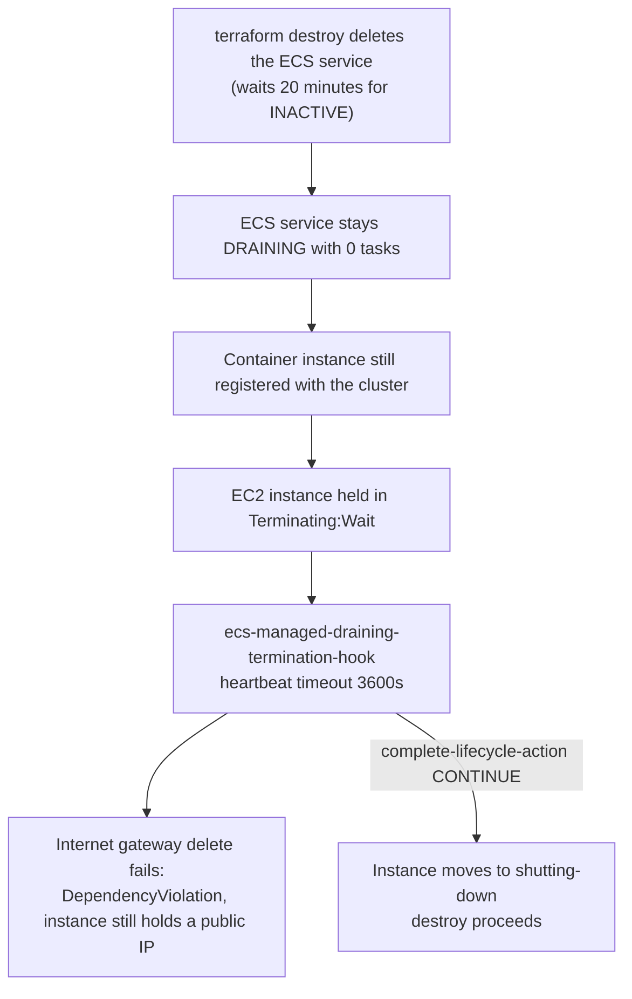

# EC2 compute pools

**Version**: meroku v4.0.1 · YAML schema v26 · `hashicorp/aws ~> 5.0`
**Last updated**: 2026-08-19
**Covers**: `compute.pools`, `workload.backend_runtime`, `services[].runtime`

A compute pool is a named set of EC2 instances that ECS places tasks on instead of Fargate. meroku
renders each pool as an Auto Scaling group, a launch template and an ECS capacity provider in
`modules/workloads/ec2_capacity.tf`. Your service keeps its image, environment variables, scaling
rules and load balancer. Only the machine underneath changes.

Read [the teardown runbook](#tearing-down-a-pool) before you create your first pool. Creating one is
a two-line YAML change; deleting one is the part that goes wrong, and the errors it produces name
nothing useful.

Everything described here was deployed to a live AWS account on 2026-08-18 — 141 resources, tasks
placed on the pool, `curl https://api.example.com/` answering HTTP 200 through the whole chain — and
then destroyed. [Two behaviours were never exercised](#what-has-not-been-exercised); they are named
at the end rather than hidden in a caveat.

---

## Quick start: put the backend on EC2

```yaml
# project/dev.yaml
schema_version: 26

workload:
  backend_runtime: ec2      # the only line you have to add
```

```bash
task infra-gen-dev
task infra-plan env=dev
task infra-apply env=dev
```

Generation prints the pool it invented for you:

```
  → No compute pool defined; synthesizing pool "default" for 1 EC2 workload(s)
      instance_types:  m7i-flex.large, m6i.large, m6a.large
      capacity_type:   on_demand
      network_mode:    bridge
      size:            min 1, max 6, target capacity 100
```

The synthesized pool lives in the rendered Terraform only. It is never written back to your YAML,
so it will not appear in `git diff` — that printout is the only place it is visible. The web UI's
Compute tab shows a banner offering to write it into `dev.yaml` so you can edit it.

Synthesis happens only when the environment defines **no** pools at all. Once `compute.pools` has
one entry, meroku stops guessing: a service with `runtime: ec2` and an empty `compute_pool` is a
generate-time refusal, not a silent choice between your pools.

Already know the shape? Jump to [pool fields](#pool-fields) or straight to the
[destroy runbook](#tearing-down-a-pool).

---

## What a pool creates

For project `myapp`, environment `dev`, pool `general`:

| Terraform resource | AWS name | Notes |
|---|---|---|
| `aws_launch_template.pool["general"]` | `myapp_general_dev` | IMDSv2 required, encrypted gp3 root volume, no `instance_type` (the ASG supplies them) |
| `aws_autoscaling_group.pool["general"]` | `myapp_general_dev` | `protect_from_scale_in = true`, `desired_capacity` unmanaged by Terraform |
| `aws_ecs_capacity_provider.pool["general"]` | `myapp_general_dev` | managed scaling, managed draining and managed termination protection all `ENABLED` |
| `aws_iam_role.ecs_instance` | `myapp_ecs_instance_dev` | shared by every pool in the environment |
| `aws_iam_instance_profile.ecs_instance` | `myapp_ecs_instance_dev` | shared |
| `aws_security_group.ecs_instance` | `myapp_ecs_instance_dev` | shared; carries the bridge-mode ingress |

ECS managed scaling owns `desired_capacity`, which is why Terraform neither sets nor reasserts it.
The instance role carries `AmazonEC2ContainerServiceforEC2Role` and `AmazonSSMManagedInstanceCore`,
so you get Session Manager onto the host without a bastion or an SSH key.

An environment with no `compute:` block is unaffected by all of this. Every resource in
`ec2_capacity.tf` is guarded on the pool list being non-empty after the `enabled` filter, so a
Fargate-only environment plans `0 to add, 0 to change, 0 to destroy` on the first apply after
upgrading to schema v26.

---

## Pool fields

```yaml
compute:
  pools:
    - name: general
      enabled: true
      instance_types: [m7i-flex.large, m6i.large, m6a.large]
      capacity_type: spot_with_base
      on_demand_base: 1
      min_size: 1
      max_size: 6
      target_capacity: 100
      network_mode: bridge
      assume_egress: false
      ami_family: al2023
      ami_id: ""
      root_volume_gb: 30
      user_data_extra: ""
      extra_volumes: []
      instance_policies: []

workload:
  backend_runtime: ec2
  backend_compute_pool: general

services:
  - name: api
    runtime: ec2
    compute_pool: general
  - name: worker
    runtime: fargate        # mixed runtimes in one environment are fine
```

| Field | Default | What it does |
|---|---|---|
| `name` | required | Becomes `${project}_${name}_${env}` on the ASG, capacity provider and launch template. Stick to lowercase letters, digits and hyphens. Duplicate names are refused — `for_each` would collapse them into one pool with no plan diff to show it. |
| `enabled` | `true` | `false` removes the pool from the module entirely. A service pointing at a disabled pool is refused at generate time, because Terraform would otherwise fail with `Error: Invalid index` against a locals expression you have never seen. |
| `instance_types` | required | Every type the ASG may launch, rendered as `mixed_instances_policy` overrides. Cost estimates quote the first entry with a known price. |
| `capacity_type` | `on_demand` | `on_demand`, `spot`, or `spot_with_base`. Maps to `on_demand_base_capacity` / `on_demand_percentage_above_base_capacity` as `(0,100)`, `(0,0)` and `(on_demand_base,0)`. Spot allocation uses `price-capacity-optimized`. |
| `on_demand_base` | `0` | Counts **instances**, not tasks. Only meaningful under `spot_with_base`; setting it under `on_demand` is refused, because that config reads as "one guaranteed instance, the rest spot" and silently bills full price for all of them. |
| `min_size` | `1` | ASG floor. At `1` you pay for an instance whether or not a task runs on it. |
| `max_size` | `6` | ASG ceiling. Tasks that do not fit under it sit in `PENDING`. |
| `target_capacity` | `100` | ECS managed scaling target, 1-100. At `100` ECS packs instances full before adding one; lower it to keep spare room for bursts. |
| `network_mode` | `bridge` | See [network mode](#network-mode-bridge-by-default). `awsvpc` needs `assume_egress: true` on the same pool. |
| `assume_egress` | `false` | An **assertion, not a provisioner**. It is read at generate time, is never rendered into Terraform, and nothing under `modules/` reads it. Setting it to `true` states that you have given these subnets a route to the internet outside meroku, and it is the only thing that unlocks `awsvpc`. |
| `ami_family` | `al2023` | `al2023`, `al2023_arm64` or `al2023_gpu`. Picks the ECS-optimized AMI SSM parameter. `al2023_arm64` also flips the task definition's CPU architecture, and the architecture must match the instance types. |
| `ami_id` | `""` | An explicit AMI. Wins over `ami_family` and skips the SSM lookup. |
| `root_volume_gb` | `30` | Encrypted gp3 root volume, deleted on termination. |
| `user_data_extra` | `""` | Appended verbatim after the `ECS_CLUSTER=` line meroku writes to `/etc/ecs/ecs.config`. |
| `extra_volumes` | `[]` | Additional block devices: `{device_name, size_gb, type}`. Rendered into the launch template; no UI editor yet. |
| `instance_policies` | `[]` | Extra IAM statements `{actions, resources}`, flattened onto the shared instance role. |

Both runtime keys — `workload.backend_runtime` and `services[].runtime` — default to `fargate`. The
v26 migration stamps that value onto existing files so the choice is visible in YAML before you have
to make it. Stamping changes no behaviour: `runtime: fargate` renders the same literal
`launch_type = "FARGATE"` that shipped before pools existed.

Generation refuses twelve configurations outright, each with the AWS failure it prevents spelled
out: a pool reference that does not resolve, a disabled pool, `min_size > max_size`, an AMI family
that disagrees with the instance types, a task whose memory no instance in the pool can hold,
`awsvpc` without `assume_egress`, and X-Ray on a bridge pool among them. Run `task infra-gen-dev`
early and often — it is faster than `terraform plan` and its messages name the YAML key.

---

## Network mode: bridge by default

EC2 pools default to `network_mode: bridge`, and that default is load-bearing rather than
conservative.

This VPC has public subnets only and no NAT gateway, by an architecture decision that predates
compute pools. A Fargate task reaches the internet because `assign_public_ip = true` gives its ENI
a public address — and that flag is Fargate-only. An EC2 task under `awsvpc` gets its own ENI with a
**private address only**: `map_public_ip_on_launch` applies to the instance's primary interface, not
to an ENI the ECS agent creates afterwards.

The failure that produces is invisible in every signal an operator checks:

| Path | `awsvpc` on EC2 | `bridge` on EC2 |
|---|---|---|
| Container image pull | works — the Docker daemon uses the host ENI | works |
| CloudWatch log shipping | works — the log driver uses the host ENI | works |
| Secrets and `env_files_s3` at task start | works — the ECS agent uses the host ENI | works |
| ALB to task, task to RDS, Cloud Map | works — in-VPC | works |
| **Your application's outbound calls** | **times out silently** | works |
| **ECS Exec ("Connect to container")** | **times out silently** | works |

The task starts, passes its health check, serves traffic and ships logs while every call to S3, SES,
SQS, Cognito, Secrets Manager or a third-party API hangs. The deployment looks healthy. That
asymmetry is why `awsvpc` is a refusal rather than a warning.

Under `bridge` there is no task ENI at all. The container sits behind the Docker bridge and NATs out
through the instance's primary interface, which has a public address and a route to the internet
gateway. Egress costs nothing extra and needs no VPC change.

That last claim is the premise the whole default rests on, so it was tested rather than reasoned
about. On the live deploy a bridge-mode task pulled its container image from a public registry and
started; under `awsvpc` in this NAT-less VPC the same pull would have hung and the task would have
died in `PROVISIONING`. The rest of the run matched:

```
containerPort 80  ->  hostPort 32769      # from hostPort = 0
target group      ->  type: instance, targets healthy on 32769 and 32768
placement         ->  two tasks bin-packed on one instance
service discovery ->  SRV-only registration for both services
```

Two tasks on one `m7i-flex.large` is the density argument made concrete: that instance reports three
ENIs, so an `awsvpc` pool would have capped at two tasks and stopped.

### What bridge costs

| Cost | Consequence |
|---|---|
| No per-task security groups | Every task on a pool shares the instance security group. Anything in the VPC can reach any ephemeral port on a pool instance. |
| Load balancer registration | Bridge services get their own `target_type = "instance"` target groups. Existing `ip` target groups are never modified, so no live target group changes type. |
| Service discovery | Cloud Map registers **SRV only** for bridge services: the host port is chosen at placement time, and an A record cannot describe a port. |
| Port range | The instance security group opens 32768-65535 to the ALB and to the VPC CIDR, because `hostPort: 0` asks Docker for an ephemeral port. |
| X-Ray | Refused on a bridge pool. The ADOT sidecar binds fixed host ports (2000, 4317, 4318, 55681), and the application container sits in a different network namespace from the daemon. |

Consumers keep working through the same Cloud Map name either way — `SERVICE_INTERNAL_URL` and the
API Gateway private integration resolve the same service object, only the record type behind it
differs.

### When to use awsvpc instead

Pick `awsvpc` when a workload genuinely needs per-task security groups, and only after you have
given the subnets a real egress path yourself. Then say so on the pool:

```yaml
compute:
  pools:
    - name: batch
      instance_types: [m6i.large]
      network_mode: awsvpc
      assume_egress: true     # you have a NAT gateway or equivalent; meroku creates none
```

Without that assertion, generation stops:

```
compute.pools["batch"].network_mode is "awsvpc" but this environment has no egress path.
...
Either set compute.pools["batch"].network_mode: bridge (the default; tasks egress through the
instance's own public interface at no cost), or set compute.pools["batch"].assume_egress: true to
declare that the subnets you place tasks in route 0.0.0.0/0 to a NAT gateway you manage
yourself. meroku does not create one: this VPC is public-subnet-only by design.
```

One more thing `awsvpc` costs: ENI density. An `m7i-flex.large` reports three network interfaces,
one of which is the host's — so two tasks per instance under `awsvpc`. The same instance under
`bridge` is bounded only by CPU and memory, which for a 256-CPU / 512-MiB task is eight.

---

## Switching a deployed service between runtimes

Under the pinned provider (`~> 5.0`), flipping `runtime` or `backend_runtime` on a service that is
already deployed **recreates the ECS service, with downtime**. Not "may recreate". Terraform
destroys the old service and creates a new one, and there is no create-before-destroy path, because
ECS service names are unique per cluster.

This is true in both directions: Fargate to EC2, and EC2 back to Fargate. Plan it for a maintenance
window.

Two related edits deserve the same caution:

- **Renaming a pool, or moving a service to a different pool.** The pool is keyed by name, so a
  rename destroys one ASG, capacity provider and launch template and creates another. Every instance
  is replaced and every task on the pool restarts. `force_new_deployment = true` on the EC2 branch is
  what keeps the ECS service resource itself an in-place update rather than a replacement.
- **Changing a pool's `network_mode` on a live pool.** The task definition, the target group and the
  service-discovery record all change, so services on that pool are recreated.

Read the plan before applying either. If `aws_ecs_service` shows `# forces replacement`, you are in
the downtime case regardless of what any UI copy says.

### The two-apply flip for a service with service discovery

Cloud Map's `dns_records[*].type` is ForceNew, and AWS rejects removing `service_registries` from a
live ECS service. So a deployed service moving between `awsvpc` (A record) and `bridge` (SRV record)
cannot be flipped in a single apply. Use `enabled` to remove it and bring it back:

```yaml
# Apply 1 — remove the service and its registration
services:
  - name: api
    enabled: false
```

```yaml
# Apply 2 — bring it back on the pool
services:
  - name: api
    enabled: true
    runtime: ec2
    compute_pool: general
```

Run `task infra-gen-dev && task infra-apply env=dev` between the two edits. The flip is already a
downtime operation, so this adds an apply, not a new class of disruption.

---

## Tearing down a pool

Two situations, two procedures. Removing a pool from a living environment is ordinary Terraform
work. Destroying an environment that has ever placed a task on a pool is the one that hangs, and
step 3 below is the step nothing in the error output points you toward.

### Removing a pool, keeping the environment

```
STEP 0.  Take a maintenance window. Step 1 recreates every ECS service on the pool.
         This is not a rolling deployment: the service is destroyed and created, and it is
         unavailable in between.
STEP 1.  Set runtime: fargate (and backend_runtime: fargate) on every service on the pool.
         task infra-gen-dev && task infra-apply env=dev
         Expect "N to destroy, N to add" on aws_ecs_service.
STEP 2.  Delete the compute.pools entries.
         task infra-gen-dev && task infra-apply env=dev
         The cluster association is replaced first, then the capacity providers, ASGs and
         launch templates are destroyed.
```

Order matters. AWS refuses to delete a capacity provider that a cluster's provider list still
references, so the module replaces the association before the providers go.

### Destroying the whole environment

`terraform destroy` on an environment whose pool has run tasks fails like this, after twenty minutes
of apparent progress:

```
Error: waiting for ECS Service delete: timeout while waiting for state to become 'INACTIVE'
       (last state: 'DRAINING', timeout: 20m0s)

Error: deleting EC2 Internet Gateway (igw-EXAMPLE): DependencyViolation:
       Network vpc-EXAMPLE has some mapped public address(es).
```

Neither message names the cause. `managed_draining = "ENABLED"` on the capacity provider makes ECS
install an Auto Scaling lifecycle hook named `ecs-managed-draining-termination-hook` with a
**3600-second** heartbeat timeout. On teardown the instance sits in `Terminating:Wait` for up to an
hour. Terraform's ECS service deletion waits twenty minutes, so it always loses the race.



Only a service that actually placed tasks hangs. A service that never ran one reaches `INACTIVE`
cleanly, which is why a partial teardown can look like it is working.

Run these four steps in order. This sequence was executed on a live teardown, not designed on paper:
steps 1 and 2 were tried first and **the instance stayed running**, and step 3 released it
immediately. Scale-in protection is a red herring on its own — the hook, not the protection, is what
holds the instance. Skipping step 3 costs you the full hour.

**1. Scale every service on the pool to zero.**

```bash
aws ecs list-services --cluster myapp_cluster_dev --output text

aws ecs update-service \
  --cluster myapp_cluster_dev \
  --service myapp_service_dev \
  --desired-count 0
```

Repeat for each service on the pool (`myapp_service_api_dev`, and so on).

**2. Drop scale-in protection and floor the ASG.**

```bash
aws autoscaling set-instance-protection \
  --auto-scaling-group-name myapp_general_dev \
  --instance-ids i-0EXAMPLE0EXAMPLE0 \
  --no-protected-from-scale-in

aws autoscaling update-auto-scaling-group \
  --auto-scaling-group-name myapp_general_dev \
  --min-size 0 --desired-capacity 0
```

The instance is now marked for termination — and will not terminate.

**3. Complete the draining lifecycle hook. This is the step that unblocks.**

```bash
aws autoscaling complete-lifecycle-action \
  --lifecycle-hook-name ecs-managed-draining-termination-hook \
  --auto-scaling-group-name myapp_general_dev \
  --lifecycle-action-result CONTINUE \
  --instance-id i-0EXAMPLE0EXAMPLE0
```

The instance moves from `Terminating:Wait` to `shutting-down` immediately. Repeat per instance if
the pool ran more than one.

**4. Destroy.**

```bash
task infra-destroy env=dev
```

After the hook is completed, the destroy runs clean: `terraform state list` returns nothing, and the
Route53 zone is left byte-identical to its pre-deploy state.

### Diagnostics for a hanging destroy

Confirm the instance state before reaching for step 3:

```bash
aws autoscaling describe-auto-scaling-groups \
  --auto-scaling-group-names myapp_general_dev \
  --query 'AutoScalingGroups[0].Instances[].[InstanceId,LifecycleState,ProtectedFromScaleIn]' \
  --output table
```

```
------------------------------------------------------------
|                DescribeAutoScalingGroups                 |
+----------------------+----------------------+------------+
|  i-0EXAMPLE0EXAMPLE0 |  Terminating:Wait    |  False     |
+----------------------+----------------------+------------+
```

Confirm the hook and its timeout:

```bash
aws autoscaling describe-lifecycle-hooks \
  --auto-scaling-group-name myapp_general_dev \
  --query 'LifecycleHooks[].[LifecycleHookName,LifecycleTransition,HeartbeatTimeout,DefaultResult]' \
  --output table
```

```
-------------------------------------------------------------------------------------------------
|  ecs-managed-draining-termination-hook | autoscaling:EC2_INSTANCE_TERMINATING | 3600 | CONTINUE |
-------------------------------------------------------------------------------------------------
```

Managed draining stays enabled deliberately: it is what makes a spot reclaim graceful during normal
operation. The hour-long hook is only pathological at teardown, which is what this runbook exists
for.

---

## Troubleshooting

Each entry leads with the message you actually see, because none of them says what is wrong.

### `AccessDenied: You are not authorized to use launch template: lt-EXAMPLE`

**Symptom.** `terraform apply` gets through the VPC, cluster, ALB, certificates, database and the
launch template itself, then fails on one resource:

```
Error: creating Auto Scaling Group (myapp_general_dev):
  AccessDenied: You are not authorized to use launch template: lt-EXAMPLE
```

**Cause.** Often not IAM, and not the launch template. An AWS Organizations service control policy
can deny `ec2:RunInstances` — sometimes only for certain instance types. Auto Scaling attempts the
launch on your behalf, gets denied, and reports the only thing it can see: that it could not use the
launch template. The real denial never reaches the Terraform output.

**Diagnose** with a non-mutating dry run, which returns the true denial in one line:

```bash
aws ec2 run-instances --dry-run \
  --launch-template LaunchTemplateId=lt-EXAMPLE,Version='$Latest' \
  --region us-east-1
```

An allowed account answers `Request would have succeeded, but DryRun flag is set`. A denied one
answers with the policy that stopped it:

```
An error occurred (UnauthorizedOperation) when calling the RunInstances operation:
You are not authorized to perform this operation. ... is not authorized to perform:
ec2:RunInstances on resource: arn:aws:ec2:us-east-1:123456789012:instance/*
with an explicit deny in a service control policy:
arn:aws:organizations::123456789012:policy/o-EXAMPLE/service_control_policy/p-EXAMPLE
```

**Fix.** Ask the organization administrator to permit `ec2:RunInstances` for this account, or for
the instance types your pool lists. No IAM policy in the member account can override an SCP deny.
Until then, run the workload on Fargate.

**Prevention.** Dry-run before the first EC2 apply in any new account. It costs nothing and settles
in one call what timestamps and IAM diffs will not.

### `DRAINING` timeout plus `DependencyViolation` on the internet gateway

**Symptom.** The error pair at the top of
[destroying the whole environment](#destroying-the-whole-environment).

**Cause.** The ECS managed-draining lifecycle hook, 3600-second timeout, against Terraform's
20-minute service-delete wait.

**Fix.** The four-step procedure above. Step 3 is the one that matters.

**Prevention.** Never run `terraform destroy` on a pool environment without scaling services to zero
and completing the hook first.

### `InvalidParameterValue: ... iamInstanceProfile is invalid` in scaling activities

**Symptom.** The apply succeeds but the pool has no instances. The ASG's scaling activities show
repeated failed launches:

```bash
aws autoscaling describe-scaling-activities \
  --auto-scaling-group-name myapp_general_dev \
  --max-items 5 \
  --query 'Activities[].[StatusCode,StatusMessage]' --output table
```

**Cause.** IAM eventual consistency. An instance profile is usable before its role's policy
attachments have propagated, so the first launch after a fresh apply can be rejected. The module
already carries explicit `depends_on` edges for this; what remains is propagation delay, not
ordering.

**Fix.** Re-run `task infra-apply env=dev`. The ASG also retries on its own schedule.

**Prevention.** None needed — it clears within minutes and cannot recur once the profile is warm.

### Tasks stuck in `PENDING`

**Symptom.** Service events repeat: `unable to place a task because no container instance met all of
its requirements`.

**Causes**, in the order worth checking:

1. The pool is at `max_size` and managed scaling cannot add capacity.
2. The task's `cpu` or `memory` exceeds what one instance can offer after agent overhead. A task
   larger than the instance never places, at any scale.
3. Under `bridge`, a second task wants a host port the first one already holds — the X-Ray sidecar's
   fixed ports are the usual culprit, which is why X-Ray on a bridge pool is refused at generate
   time.

**Diagnose**:

```bash
aws ecs describe-services \
  --cluster myapp_cluster_dev --services myapp_service_dev \
  --query 'services[0].events[0:5].message' --output table

aws ecs describe-container-instances \
  --cluster myapp_cluster_dev \
  --container-instances $(aws ecs list-container-instances \
    --cluster myapp_cluster_dev --query 'containerInstanceArns[0]' --output text) \
  --query 'containerInstances[].remainingResources'
```

**Fix.** Raise `max_size`, add a larger instance type to `instance_types`, or lower the service's
`cpu` and `memory`. Generation refuses case 2 when it can see it — a task whose memory exceeds the
largest type in its pool — but a task that fits the instance and not the *remaining* capacity is a
runtime condition no static check can catch.

---

## Cloud Map records are compared by position

In `modules/workloads/backend.tf` and `services.tf`, the service-discovery block looks like this:

```hcl
dynamic "dns_records" {
  for_each = local.backend_bridge ? [] : [1]
  content {
    ttl  = 10
    type = "A"
  }
}

dns_records {          # always, both network modes
  ttl  = 10
  type = "SRV"
}
```

The dynamic `A` block comes first and the static `SRV` block second. That order is load-bearing.
Terraform compares `dns_config.dns_records` as a **list, positionally**, so swapping the two blocks
plans a replacement of **every Cloud Map service in the environment** — with no behavioural change to
justify it.

Moving the static block above the dynamic one looks like a cosmetic tidy-up in review, and it is the
kind of change nobody plans carefully. Leave the order alone. If you do touch this block, confirm
the plan is a no-op against an environment that already has A and SRV records.

---

## What a pool costs

EC2 is billed per instance-hour, not per task. A pool at `min_size: 1` costs money with zero tasks
running, and a pool packed to `target_capacity: 100` costs the same as one running a single task on
the same instance.

That is why meroku attributes the money to the pool and reports an EC2-runtime **service** as `$0`
marginal. The Fargate per-task formula — vCPU-hours plus GB-hours per task, times desired count —
would bill the same instance once per task and overstate the total by the replica count.

A pool's estimate blends on-demand and spot the way the ASG's `instances_distribution` does:

```
n_od = on_demand_base under spot_with_base, N under on_demand, 0 under spot
n_sp = N - n_od
hourly  = n_od * price_on_demand + n_sp * (price_on_demand * spot_ratio)
monthly = hourly * 730
```

The price is quoted against the first entry of `instance_types` that has a known on-demand rate.
Your ASG may launch any type in the list, so treat the figure as a basis, not a bill. A pool whose
types all have unknown prices reports **unknown**, never `$0` — absent data and free are different
answers.

Two practical consequences:

- `min_size: 0` is a real option for a pool that only serves scheduled work. It costs nothing while
  idle, at the price of a cold start when ECS has to launch an instance.
- Moving one small service off Fargate rarely saves money. Moving several onto one right-sized
  instance does, because the instance you were going to pay for anyway gets packed.

---

## What has not been exercised

Two behaviours in this document come from reading the provider and the AWS contracts rather than
from watching them happen. Treat them as the places to keep an eye on:

1. **Scale-in during normal operation.** ECS managed scaling adding capacity is proven; removing an
   instance as demand drops is not. The validation environment ran at fixed size for its whole life.
   If a pool stays at its high-water mark long after traffic drops, check the ASG's scaling
   activities before assuming the target capacity is wrong.
2. **Pool rename and `compute_pool` reassignment as an in-place update.** `force_new_deployment` on
   the EC2 branch should make a strategy-to-strategy edit an `UpdateService` call rather than a
   service replacement, and that has never been confirmed against a live plan. Read the plan; if
   `aws_ecs_service` shows `# forces replacement`, treat it as the downtime case.

Everything else — capacity provider registration, instance join, task placement, bridge port
mapping, bridge egress, instance target groups, SRV service discovery, bin-packing, HTTPS ingress
end to end, and the teardown procedure above — was observed on a live account.

---

## Related documents

- [`ai_docs/EC2_FARGATE_RUNTIME_PLAN.md`](./EC2_FARGATE_RUNTIME_PLAN.md) — the accepted design this
  feature was built from
- [`ai_docs/MIGRATIONS.md`](./MIGRATIONS.md) — how schema v26 reaches your YAML files
- [`ai_docs/YAML_SPECIFICATION.md`](./YAML_SPECIFICATION.md) — the full configuration schema
- [`docs/ENVIRONMENT_CONFIGURATION.md`](../docs/ENVIRONMENT_CONFIGURATION.md) — environment-level
  settings, including VPC options
